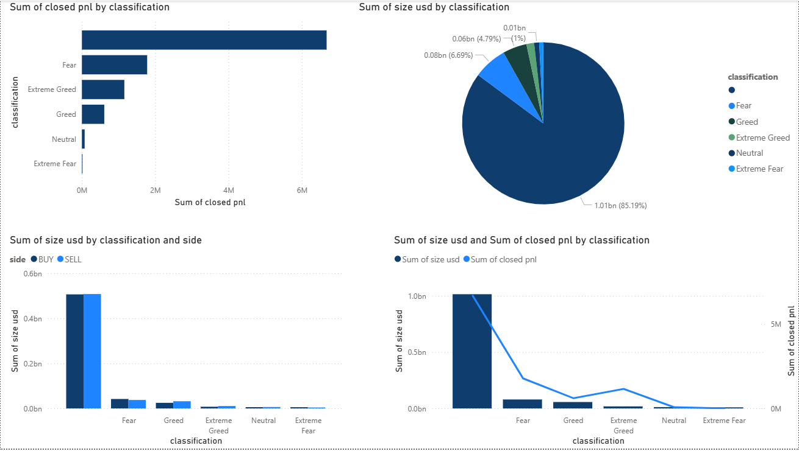

# 📊 Trader Behaviour Insights

A data analysis project exploring how trader sentiment influences trading outcomes and market activity.  
This project combines Python data processing and Power BI visualization to reveal behavioral trading patterns.

---

## 🚀 Project Overview
The goal of this project is to analyze and visualize **how market sentiment impacts trader decisions** — such as profitability, trade volume, and activity level.

Using the combined dataset of trader performance and market sentiment, insights were drawn through:
- Python-based data cleaning and preprocessing  
- Statistical summaries and CSV outputs  
- Interactive dashboards built in Power BI  

---

## 🧠 Key Insights
- Higher *Greed* sentiment often corresponds to **lower average profitability**.
- *Fear* periods show **reduced trade volume** but more cautious decision-making.
- *Neutral* sentiment shows the **most stable trading behavior**.

---

## 🧰 Tools & Technologies
| Tool | Purpose |
|------|----------|
| 🐍 Python | Data preprocessing, merging datasets |
| 📊 Power BI | Dashboard & data visualization |
| 📁 Pandas, NumPy | Data manipulation |
| 💾 CSV | Data storage and sharing |

---

## 📂 Project Files
| File | Description |
|------|-------------|
| `trader_sentiment_analysis.ipynb` | Python notebook for data processing |
| `merged_trader_sentiment_data.csv` | Cleaned dataset for analysis |
| `Trader_Behaviour_Insights.pbix` | Power BI dashboard file |
| `sentiment_profitability_summary.csv` | Summary: sentiment vs profit |
| `sentiment_activity_summary.csv` | Summary: sentiment vs activity |

---

## 🖼️ Dashboard Preview

---

## 📈 Results
- Extracted trader sentiment patterns from raw trade and sentiment data  
- Built a **Power BI dashboard** visualizing profit trends, trade volumes, and sentiment correlations  
- Generated summary CSVs highlighting performance under different market moods  

---

## 👤 Author
**Raunak Das**  
*Data Science | Analytics Enthusiast*  
📧 *Email:* [raunakd35@gmail.com]  
🔗 *LinkedIn:* [https://www.linkedin.com/in/raunak-das/]  

---

### 💡 Future Improvements
- Add predictive models to forecast trading sentiment trends  
- Automate dashboard refresh with live data feeds  
- Explore multi-market sentiment correlations
